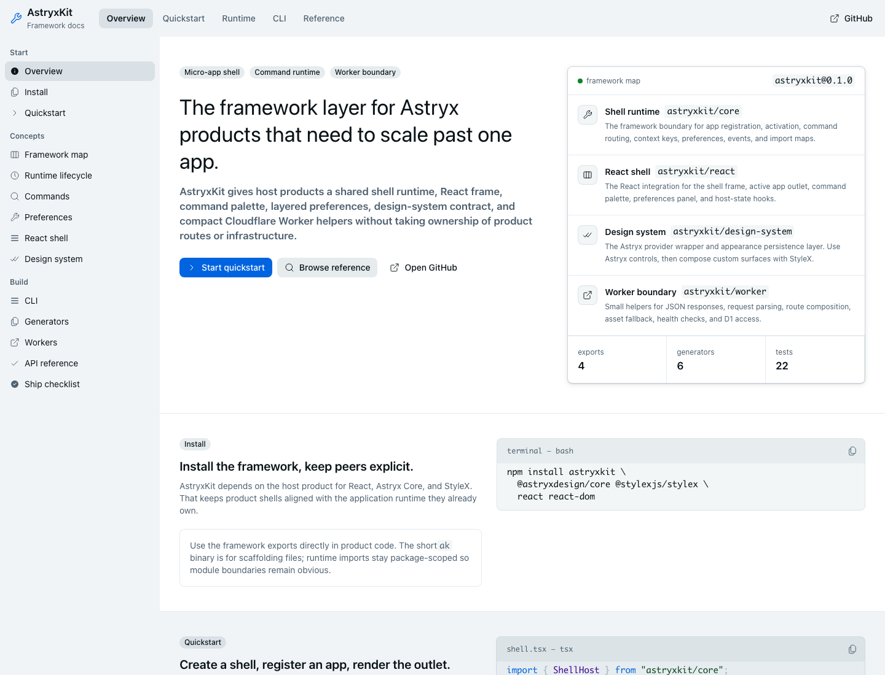

# AstryxKit

[](https://www.npmjs.com/package/astryxkit)
[](https://thedjpetersen.github.io/astryxkit/)
[](LICENSE)

AstryxKit is the Astryx presentation library for [App Foundry](https://github.com/thedjpetersen/app-foundry) applications.

It renders App Foundry feature models as an Astryx shell frame, command palette, preferences surface, App Module outlet, and error boundary.

AstryxKit does not own application lifecycle, commands, preferences, events, access control, Worker helpers, or shared contracts. Those belong to App Foundry.



## Scope

| AstryxKit owns | App Foundry owns |
| --- | --- |
| Astryx components and composition | App manifests and activation |
| Shell frame and navigation rendering | Commands, preferences, events, and entities |
| Command-palette presentation | Access control and import maps |
| Preferences presentation | Headless React feature models |
| App outlet and error presentation | Worker helpers and neutral generator mechanics |
| Theme, appearance, icons, and StyleX | Stable contracts shared by every UI kit |
| Astryx-branded generator recipes | Filesystem safety and naming rules |

Host products still own routes, customer policy, bindings, persistence, schema, and deployment.

## Install

The npm registry currently serves AstryxKit `0.1.0`. This repository is preparing `0.2.0`, which separates framework contracts into App Foundry.

For the released package:

```sh
npm install astryxkit @astryxdesign/core @stylexjs/stylex react react-dom
```

For the `0.2.0` source architecture, install App Foundry alongside AstryxKit:

```sh
npm install app-foundry astryxkit \
  @astryxdesign/core @stylexjs/stylex react react-dom
```

Application code should import durable contracts from App Foundry and presentation from AstryxKit.

```ts
import { ShellHost, createShellSDK } from "app-foundry/core";
import { astryxPresentationAdapter } from "astryxkit/react";
```

## Presentation Adapter

```tsx
import { ShellHost } from "app-foundry/core";
import {
  AstryxKitProvider,
} from "astryxkit/design-system";
import {
  ShellAppOutlet,
  ShellFrame,
} from "astryxkit/react";

const host = new ShellHost();

export function ProductShell() {
  return (
    <AstryxKitProvider>
      <ShellFrame
        host={host}
        workspace={{ name: "Northstar", slug: "northstar" }}
        currentPathname="/app/catalog"
        brandName="Northstar"
      >
        <ShellAppOutlet
          appId="catalog"
          host={host}
          workspace={{ name: "Northstar", slug: "northstar" }}
          route={{ pathname: "/app/catalog", slug: "catalog" }}
          navigate={(href) => host.navigate(href)}
        />
      </ShellFrame>
    </AstryxKitProvider>
  );
}
```

The feature-level adapter keeps App Modules portable. They depend on framework contracts instead of importing Astryx components into domain behavior.

## Public Exports

| Export | Purpose |
| --- | --- |
| `astryxkit/react` | Astryx frame, palette, preferences, App Module outlet, error boundary, and presentation adapter. |
| `astryxkit/design-system` | Theme provider, appearance persistence, and shared media-query constants. |
| `astryxkit/core` | Deprecated App Foundry compatibility re-exports during the `0.x` migration. |
| `astryxkit/worker` | Deprecated App Foundry Worker compatibility re-exports during the `0.x` migration. |

Use `app-foundry/core`, `app-foundry/react`, and `app-foundry/worker` for new framework code.

## Design-System Integration

`AstryxKitProvider` applies the AstryxKit theme and appearance persistence behavior. The host owns React, Astryx Core, and StyleX as peer dependencies.

The package also exports shared `mediaQueries` constants so Astryx applications do not redeclare input-capability and breakpoint queries.

When changing UI in this repository, follow `AGENTS.md`: inspect the Astryx template and component docs first, use design tokens, and use `xstyle` for custom styling.

## Generators

AstryxKit owns recipes that emit Astryx imports, components, and layout. App Foundry supplies the neutral naming and filesystem-safety engine.

```sh
npx astryxkit generators
npx astryxkit generate shell Northstar
npx astryxkit generate app Catalog --dry-run
```

The short `ak` binary exposes the same commands.

## Compatibility

AstryxKit `0.2.0` keeps deprecated framework exports so existing `astryxkit/core` and `astryxkit/worker` imports can migrate incrementally.

The compatibility layer also adopts the legacy AstryxKit shell singleton. The neutral App Foundry runtime contains no Astryx-branded global or UI dependency.

## Documentation

- [AstryxKit docs site](https://thedjpetersen.github.io/astryxkit/)
- [App Foundry docs](https://thedjpetersen.github.io/app-foundry/)
- [App Foundry Motivation](https://thedjpetersen.github.io/app-foundry/motivation/)
- [App Foundry Architecture](https://thedjpetersen.github.io/app-foundry/architecture/)
- [Presentation Seam](https://thedjpetersen.github.io/app-foundry/presentation/)
- [Astryx design-system notes](docs/design-system.md)
- [Astryx generator recipes](docs/generators.md)

## Development

Clone with the standalone App Foundry repository initialized as a submodule:

```sh
git clone --recurse-submodules git@github.com:thedjpetersen/astryxkit.git
cd astryxkit
npm ci
npm run validate
```

If the repository is already cloned, run `git submodule update --init --recursive` before installing dependencies.

`npm run validate` type-checks, runs the compatibility and adapter tests, builds both packages, builds the docs, and checks every docs route in light and dark mode.

## Repository Layout

```text
packages/app-foundry/   git submodule for the standalone framework repository
src/react/              Astryx presentation surfaces
src/design-system/      Astryx theme and shared media constants
src/cli/                Astryx-branded generator recipes
site/                   public AstryxKit documentation
test/                   compatibility, adapter, CLI, and integration tests
```

## License

MIT
